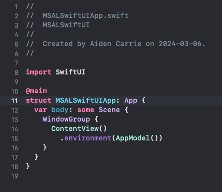

# MSALSwiftUI
This project showcases how I use MSAL in a swift ui application using **@Environment** and **@Observable**<br />
I also implement a basic navigation stack to show how the MSAL UIViewRepresentable can appear on any view in your application

Below is a complete tutorial on how to get everything working step by step in a new project, but feel free to look at the code and use it as reference if you do not want to follow entire tutorial. 

(A terrible gif of the final product in action)
[](images/MSAL.gif)

## Getting MSAL Setup
### SETUP (can [skip](#createApp) if project already setup and you have clientId, authorityURL etc..)
basic app template

do not use swiftData like I did here, leave it as default.

This is how your basic app should look

### Create Microsoft project 
[Go to MS admin portal](https://aka.ms/admincenter) and go to **Identity** -> **Application** -> **App Registration** and create a **New Registration** <br />
<br />
Add your application name and register after matching criteria in image below.<br />
<br />
Add the iOS platform under **Manage** -> **Authentication** -> **+Add Platform** -> **iOS/MacOS**<br />
<br />
It will ask for bundle Identifier which is found here. <br />
<br />
Then you save the msal configuration information that is displayed next in a notepad for future use. and select DONE <br /><br />
Next, add this [package](https://github.com/AzureAD/microsoft-authentication-library-for-objc.git) to your project<br />
<br />
Go to **Signing & Capabilities** and add the **Keychain Sharing** Capabitlity<br />
<br />
add com.microsoft.adalcache and com.microsoft.identity.universalstorage<br />
<br />
in your info.plst file add : msauth , msauthv2 , msauthv3 under **Queried URL Schemes**<br />
<br />
Add a URL type using this format msauth.--BUNDLE-IDENTIFIER-HERE--
<br />

thats IT for setup... lets start building an app with MSAL<br />

### CREATE APP <a name="createApp"></a>

Create a file to store your MSAL Properties<br />
**IMPORTANT**<br />
notice my authority URL has changed from what was given to us from microsoft.<br />
update your URL to match this format:<br />
  "https://login.microsoftonline.com/[YOUR TENANT ID]/oauth2/v2.0/authorize"<br />
you can find your tenant ID in the Overview section of your app registration on MS Admin Center.<br /><br />

```
//  MSALProperties.swift

import Foundation
import MSAL

struct Token {
  var value: String
  var expiry: Date?
}


struct MSALProperties {
  var account : MSALAccount?
  var clientID : String?      = "YOUR CLIENT ID"
  var redirectUri : String?   = "YOUR REDIRECT URI"
  var authorityUrl : String?  = "https://login.microsoftonline.com/YOUR TENANT ID/oauth2/v2.0/authorize"
  var authority : MSALAADAuthority?
  var scopes : [String]?      = ["user.read"]
  var token : Token?
  var application : MSALPublicClientApplication?
  var interactiveParameters : MSALInteractiveTokenParameters?
  var webviewParams : MSALWebviewParameters?

}
```
<br /><br />

Next, Create your App Model (for this app im using MV architecture)
I am also setting up our navigation path for the future.

```
//  AppModel.swift

import Foundation
import SwiftUI


@Observable class AppModel {
  
  //our msal properties.
  var msalProperties : MSALProperties = MSALProperties()
  
  //Navigation
  var navPath : NavigationPath = NavigationPath()
  var navPathBinding: Binding<NavigationPath> {
    Binding {
      self.navPath
    } set: { value in
      self.navPath = value
    }
  }
  
}
```
<br /><br />

Now we build our UIViewRepresentable for MSAL and setup of our properties. <br />
This viewmodel only sets up our authority, application, and parameters so we can shove them in the environment.<br />
The rest is pretty standard as per MSAL docs.<br />

```
//  MSALViewControllerRepresentable.swift

import Foundation
import SwiftUI
import MSAL

struct MSALViewController : UIViewControllerRepresentable {
  
  @Environment(AppModel.self) var model
  
  func makeUIViewController(context: Context)  -> UIViewController {
    
    let viewController =  UIViewController()
    
    if let authURL = model.msalProperties.authorityUrl,
       let clientID = model.msalProperties.clientID,
       let redirectUri = model.msalProperties.redirectUri,
       let scopes = model.msalProperties.scopes
    {
      guard let authorityURL = URL(string: authURL) else {
        print("Unable to create authority URL")
        return viewController
      }
      
      let authority : MSALAADAuthority?
      do {
        authority = try MSALAADAuthority(url: authorityURL)
        
        let config = MSALPublicClientApplicationConfig(
          clientId: clientID,
          redirectUri: redirectUri,
          authority:  authority)
        
        if let application = try? MSALPublicClientApplication(configuration: config) {
          let webviewParameters = MSALWebviewParameters(authPresentationViewController: viewController)
          
          let interactiveParameters = MSALInteractiveTokenParameters(scopes: scopes, webviewParameters: webviewParameters)
          
          model.msalProperties = MSALProperties(authority: authority, application: application, interactiveParameters: interactiveParameters, webviewParams: webviewParameters)
        }
        else {print("Unable to create application.")}
      }
      catch {print("Unable to create authority URL")}
    }
    return viewController
  }
  
  func updateUIViewController(_ uiViewController: UIViewControllerType, context: Context) {
    
  }
  
}
```
<br /><br />
Inject your Aggregate model into your environment<br />
<br />

Add Navigation to your AppModel.swift

```
  public enum Destination: Codable, Hashable {
    case login
    case home
    case screenOne
  }
  func navigate(to destination: Destination) {
    navPath.append(destination)
  }
  
  func navigateBack() {
    navPath.removeLast()
  }
  
  func navigateToRoot() {
    navPath.removeLast(navPath.count)
  }
```
<br /><br />
Setup your View<br />
In your root NavigationStack, this is where you want to place your MSALViewController so your app has access to its properties from anywhere inside.<br />
Set the frame width and height to one. this view only needs to exist on initialization of your application.
<br />
```
//  ContentView.swift

import SwiftUI

struct ContentView: View {
  
  @Environment(AppModel.self) var model
  
    var body: some View {
      NavigationStack(path: model.navPathBinding){
        VStack {
          Button(action:{}){
            Text("Interactive Login")
        }
        }
        .navigationDestination(for: AppModel.Destination.self) { page in
          switch page {
          case .home :
            EmptyView()
          case .login :
            EmptyView()
          case .screenOne :
            EmptyView()
          }
        }
      }
      .overlay{
        MSALViewController()
          .frame(width: 1, height: 1)
      }
    }
}

#Preview {
    ContentView()
    .environment(AppModel())
}
```

Lets setup an interactive login, for this I make an extension off of my aggregate model and use the + syntax for file organization<br />
so for a project using AppModel as the aggregate, I will create a new file called App+MSAL.swift<br />

```
//  App+MSAL.swift

import Foundation
import MSAL

extension AppModel {
  
  func interactiveLogin() async throws {
    
    if let params = self.msalProperties.interactiveParameters, let application = self.msalProperties.application {
      
      params.promptType = .selectAccount
      
      do {
        let result = try await Task<MSALResult, Error> { @MainActor in
          try await application.acquireToken(with: params)
        }.value

          if let token = result.idToken, let exp = result.expiresOn {
            msalProperties.token = Token(value: token, expiry: exp)
          }
          self.msalProperties.account = result.account
          //it worked... now I need to navigate my app somwhere.
          navigate(to: .home)
        
      }
      catch let error as NSError where error.domain == MSALErrorDomain && error.code == MSALError.userCanceled.rawValue {
        print("Canceled")
      } catch {
        print("Could not acquire token: \(error)")
      }
    }else {
      print("Missing interactive properties and Application MSAL")
    }
  }
  
}
```
Now we need to add a call to this in our ContenView.swift :<br />

```
// ContentView.swift
...
Button(action:{
  Task{
    try await model.interactiveLogin() <--
  }
}){
  Text("Interactive Login")
}
...
```
Now when we click our interactive button ....
<br />

Next we can implement the Silent Refresh functionality:<br />

```
  func acquireTokenSilently() async throws{
    
    if let scopes = self.msalProperties.scopes, let account = self.msalProperties.account, let application = self.msalProperties.application{
      let parameters = MSALSilentTokenParameters(scopes: scopes, account: account)

      do {
        let result = try await application.acquireTokenSilent(with: parameters)

        guard let idToken = result.idToken, let exp = result.expiresOn else {
          print("no token or expiry")
          return
        }
        
        msalProperties.token = Token(value: idToken, expiry: exp)
        self.msalProperties.account = result.account
        //this was a success !!
        //next we want to navigate
        navigate(to: .home)

        
      } catch let error as NSError where error.domain == MSALErrorDomain &&
                error.code == MSALError.interactionRequired.rawValue {
        print("Could not acquire token silently: \(error)")
        return try await interactiveLogin() //if I cant get it silently... Interactive!
      } catch {
        print("silentTokenError : \(error)")
      }
    }
  }
```
<br />

Lets add a button in our ContentView.swift to try our silent token. 

```
//ContentView.swift

...
Button(action:{
Task{
try await model.acquireTokenSilently()
}
}){
Text("Silent Login👀")
}
.buttonStyle(.borderedProminent)
...
```
Now if we run our application we can do an interactive login, go back and then log in again but silently...<br />
But if we launch the app for the first time, we cannot do a silent aquire of our token because we dont have an account!<br />
We can make this better by adding a function to check if we have an account, and then we handle if we want to have interactive or silent login.<br />

Back in App+MSAL.swift add two functions:

```
  public func checkAccountThenLogin() async throws {
    
    //check if account exists then decide whether new login or
    
    if let account = msalProperties.account {
  
    try await acquireTokenSilently()

    }else{
      // no account
      if let app = msalProperties.application {

        do {
          guard let account = try await getAccount(application: app) else {
            return try await interactiveLogin()
          }
          print("Found a signed in account \(String(describing: account.username!)). Updating data for that account...")
          msalProperties.account = account
          try await acquireTokenSilently()
        } catch {
          print("Couldn't query current account with error: \(error)")
        }
      }else {
        print("no application when loading current account")
      }
    }
  }
  
  func getAccount(application: MSALPublicClientApplication) async throws -> MSALAccount? {
    var currentAccount: MSALAccount?
    do {
      let cachedAccounts = try application.allAccounts()
      if !cachedAccounts.isEmpty {
        currentAccount = cachedAccounts.first
        print("current accoount: \(currentAccount?.username ?? "n/a")")
      }
    } catch {
      print("Didn't find any accounts in cache: \(error)")
    }
    return currentAccount
  }
```

We dont need two buttons in our ContentView.swift, we only need one, and we call our new function instead.<br />
Once we try logging in again, we wont need to run through MSAL in the UI as we have an account logged in already.<br />
<br />

To show that we can do an interavtive login from any view in the app, I will navigate to home, then to screen one and call the interactive login again.<br />

I will make two files: <br />

```
//  HomeView.swift

import SwiftUI

struct HomeView: View {
  
  @Environment(AppModel.self) var model
  
    var body: some View {
      VStack{
        Text("IM THE HOME VIEW🧛‍♂️")
        Button(action:{model.navigate(to: .screenOne)}){
          Text("Navigate deeper...")
        }
      }
    }
}

#Preview {
    HomeView()
    .environment(AppModel())
}
```

```
//  ScreenOneView.swift

import SwiftUI

struct ScreenOneView: View {
  @Environment(AppModel.self) var model
  
    var body: some View {
      VStack{
        Text("IM THE ScreenOne VIEW💩")
        Button(action:{
          Task {
            try await model.interactiveLogin()
          }
        }){
          Text("Interactive Login!!")
        }
        Spacer()
      }
    }
}

#Preview {
    ScreenOneView()
    .environment(AppModel())
}
```
<br />
Our ContentView.swift should look like this now...<br />

<br />

And here is our app running and doing an interactive login deep within our navigation stack!

<br />

Finally, we want to log out!<br />
Lets go back to our App+MSAL.swift and add two more functions...<br />
notice in our logout functions success we navigate to the root of our application.<br />

```
  public func logout() async throws {

    guard let account = self.msalProperties.account else { return }
    
    if let application = self.msalProperties.application {
      _ = try await removeAllAccounts()
      
      Task {
        {
          if let webViewParams = self.msalProperties.webviewParams {
            let signoutParameters = MSALSignoutParameters(webviewParameters: webViewParams)
            signoutParameters.signoutFromBrowser = false
            DispatchQueue.main.async {
              self.msalProperties.account = nil
              self.msalProperties.token = nil
              application.signout(with: account, signoutParameters: signoutParameters, completionBlock: {(success, error) in
                if let error = error {
                  print("Couldn't sign out account with error: \(error)")
                  return
                }

                print("Sign out SUCCESS")
                self.navigateToRoot()
              })
            }
          }else {
            print("NO WEBVIEW PARAMS FOR LOGGING OUT")
          }
         
        }()
      }
      
    }
  }
  
  func removeAllAccounts() async throws -> MSALAccount? {
    
    var currentAccount: MSALAccount?
    
    if let application = self.msalProperties.application {
      
      do {
        var cachedAccounts = try application.allAccounts()
        if !cachedAccounts.isEmpty {
          cachedAccounts.removeAll()
          print("Cached accounts removed")
        }
      } catch {
        print("Didn't find any accounts in cache: \(error)")
      }
      return currentAccount
    }
    
    return currentAccount
  }
```

Next we want to add a button in our UI to log out. <br />
Back in our ScreenOneView.swift...

```
//ScreenOneView.swift
...
        Button(action:{
          Task{
            try await model.checkAccountThenLogin()
          }
        }){
          Text("LOGOUT")
        }
        .buttonStyle(.borderedProminent)
...
```


I hope this information and tutorial will help some on their MSAL SwiftUI journey. This app does not cover all scenarios and will need to be tweaked on an app by app basis. This should help people get up and running. cheers 🍻
